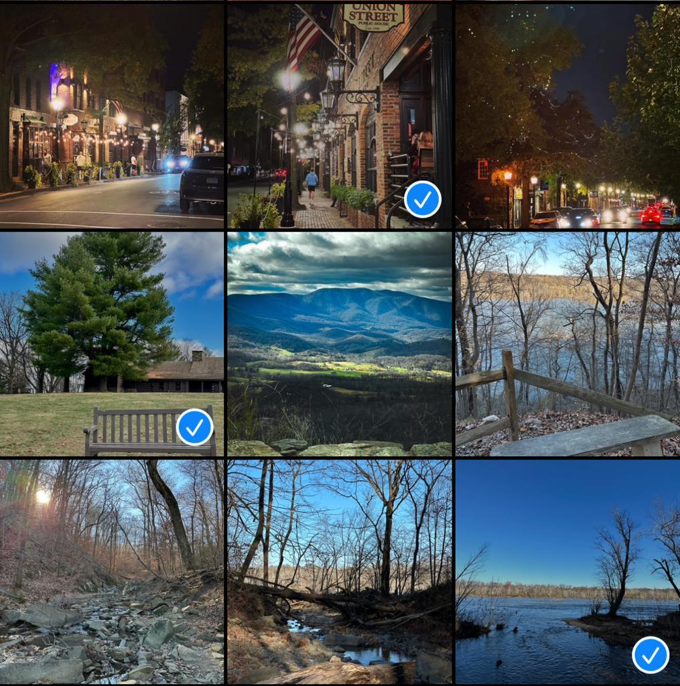

# RELAI Front-end Interview Questions

## Important Instructions
- Please make sure to follow all the steps below to generate the data you need to finish both the questions below.
- If you are facing any difficulty in the above, raise an issue in this repository.
- Any submission you make must have a `README.md` that clearly documents all the steps needed to `run` your submission.

## Setup

1. In a python virtual environment running at least python 3.9, install the requirements (`numpy`, `matplotlib`):
    ```bash
    pip install -r requirements.txt
    ```
    You may skip this step if you have those python packages already.
2. Generate dummy data:
    ```bash
    python problem1.py
    python problem2.py
    ```
These commands should create two JSON files `problem1.json` and `problem2.json` respectively which you will use in the following problems.

## Problem 1

For this problem, you will use the data in `problem1.json` which is a 2D array of shape `(5, 5000)`. The values in each row of the array represent loss values over 5000 steps of training and there are 5 models in total. Using [Plotly.js](https://plotly.com/javascript/), implement a line chart showing the loss curves for all 5 models. The following image approximately depicts what we are expecting.


Note that this is for illustrative purposes only. Please feel free to choose colors and layout decisions as you see fit. We will judge you based on overall look and functionality of the plot, some of the factors are: 

* Properly labeled axes and aesthetically pleasing colors
* An accurate legend for the models, ideally one where it is possible select/deselect each model
* Any controls over the look of the plot like smoothing, to improve readability

## Problem 2

For this problem, you will use the data in `problem2.json` and the images in the `cats_vs_dogs` folder created when you run `python problem2.py`. Implement a webpage that shows all the 20 images in the folder in a grid. Each image should be clickable and upon clicking an image, it should be evident that the image has been selected. Clicking on an already selected image, should deselect the image. This functionality is similar to how any modern mobile photos app implements image selection as illustrated in the screenshot below:



Again, this is only an illustration. So, feel free to use any style of checkmarks or other visual cues to indicate image selections.

In addition to this grid, the page should show a number labelled as "Metric" which is just the difference of average score for selected images and average score for non selected images. For example, if there were only 4 images and only image 2 was selected, the "Metric" would be:

```
Metric = score_2 - 1 / 3 * (score_1 + score_3 + score_4)
```
The individual scores for each image in the folder can be found in `problem2.json`.

You will be judged based several factors including but not limited to:
* The layout you choose to show the grid and the metric in
* Overall aesthetics of the page, particularly the image selection
* Responsiveness of the page, particularly, changing the selection of images should update the metric instantly
